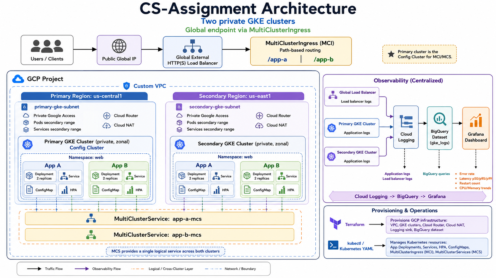

# CS-Assignment

This repository contains a GCP take-home assignment implementation using Terraform, GKE, Kubernetes manifests, MultiClusterIngress, BigQuery log analysis, and Grafana observability.

## Project Summary

The project creates:

* GCP infrastructure using Terraform
* Two private GKE clusters
* VPC-native networking with dedicated subnets and secondary IP ranges
* Cloud NAT and Private Google Access for private cluster egress
* Two sample web applications deployed to both clusters
* ConfigMaps and HPAs for the applications
* MultiClusterService and MultiClusterIngress for a globally accessible endpoint
* Cloud Logging export to BigQuery
* Grafana dashboard for observability

## Architecture Diagram



## Documentation

Additional project documentation is available in the `docs/` directory.

The `docs/` directory includes:

* Sample BigQuery queries
* Grafana dashboard screenshot/export
* Important design decisions
* Troubleshooting scenario
* Architecture diagram

## Prerequisites

Install the following tools locally:

* Google Cloud CLI
* Terraform
* kubectl

Authenticate to GCP:

```bash
gcloud auth login
gcloud auth application-default login
```

Create a project in GCP console and set the active GCP project:

```bash
gcloud config set project <PROJECT_ID>
```

## Terraform Variables

Create a Terraform variable file from the example file:

```bash
cd terraform
cp terraform.tfvars.example terraform.auto.tfvars
```

Update `terraform.auto.tfvars` with your project-specific values.

Example:

```hcl
project_id       = "your-gcp-project-id"
primary_region   = "us-central1"
secondary_region = "us-east1"
primary_zone     = "us-central1-a"
secondary_zone   = "us-east1-b"
```


## Create Infrastructure

From the `terraform/` directory, initialize Terraform:

```bash
terraform init
```

Review the Terraform plan:

```bash
terraform plan
```

Apply the infrastructure:

```bash
terraform apply
```

Terraform creates the GCP infrastructure, including:

* Required GCP APIs
* VPC and subnets
* Secondary IP ranges for GKE Pods and Services
* Cloud Router and Cloud NAT
* Private GKE clusters
* GKE node pools
* Fleet and MultiClusterIngress configuration
* Global static IP
* BigQuery dataset
* Cloud Logging sink

After the apply completes, get the Terraform outputs:

```bash
terraform output
```

Note the following outputs:

* Global public IP address

## Connect kubectl to the GKE Clusters

Configure `kubectl` access to both clusters.

Example:

```bash
gcloud container clusters get-credentials primary-cluster \
  --zone <PRIMARY_ZONE> \
  --project <PROJECT_ID>
```

```bash
gcloud container clusters get-credentials secondary-cluster \
  --zone <SECONDARY_ZONE> \
  --project <PROJECT_ID>
```

Verify the contexts:

```bash
kubectl config get-contexts
```

## Deploy Kubernetes Objects

Apply the namespace and application manifests to both clusters.

### Primary Cluster

Switch to the primary cluster context:

```bash
kubectl config use-context <PRIMARY_CLUSTER_CONTEXT>
```

Apply the namespace and application manifests:

```bash
kubectl apply -f k8s/namespace/namespace.yaml
kubectl apply -f k8s/app-a/app-a.yaml
kubectl apply -f k8s/app-b/app-b.yaml
```

Verify:

```bash
kubectl get pods -n web
kubectl get svc -n web
kubectl get hpa -n web
```

### Secondary Cluster

Switch to the secondary cluster context:

```bash
kubectl config use-context <SECONDARY_CLUSTER_CONTEXT>
```

Apply the namespace and application manifests:

```bash
kubectl apply -f k8s/namespace/namespace.yaml
kubectl apply -f k8s/app-a/app-a.yaml
kubectl apply -f k8s/app-b/app-b.yaml
```

Verify:

```bash
kubectl get pods -n web
kubectl get svc -n web
kubectl get hpa -n web
```

## Update MultiClusterIngress Static IP

Get the global public IP from Terraform output:

```bash
cd terraform
terraform output app_global_ip
```

Update the static IP annotation in:

```text
k8s/mci/mci.yaml
```

The annotation should use the literal IP address.

Example:

```yaml
metadata:
  annotations:
    networking.gke.io/static-ip: "34.xx.xx.xx"
```

## Apply MultiClusterService and MultiClusterIngress

MultiClusterService and MultiClusterIngress objects should be applied to the config cluster.

In this project, the primary cluster is used as the config cluster.

Switch to the primary cluster context:

```bash
kubectl config use-context <PRIMARY_CLUSTER_CONTEXT>
```

Apply the MultiClusterService and MultiClusterIngress manifests:

```bash
kubectl apply -f k8s/mci/app-a-mcs.yaml
kubectl apply -f k8s/mci/app-b-mcs.yaml
kubectl apply -f k8s/mci/mci.yaml
```

Verify:

```bash
kubectl get mcs -n web
kubectl get mci -n web
kubectl describe mci web-mci -n web
```

The Google Cloud load balancer may take several minutes to finish provisioning.

## Access the Application Endpoint

Get the public IP from Terraform output:

```bash
cd terraform
terraform output app_global_ip
```

Access the application using the public IP:

```bash
curl http://<GLOBAL_PUBLIC_IP>/
curl http://<GLOBAL_PUBLIC_IP>/app-a
curl http://<GLOBAL_PUBLIC_IP>/app-b
```

Expected behavior:

* `/` routes to the default backend
* `/app-a` routes to App A
* `/app-b` routes to App B

## Observability

Cloud Logging exports selected logs to BigQuery.

The BigQuery dataset and logging sink are created using Terraform.

Sample BigQuery queries are available in:

```text
docs/bigquery-queries/
```

The Grafana dashboard screenshot/export is available in:

```text
docs/screenshots/
```

## Troubleshooting Scenario

A troubleshooting scenario is documented in:

```text
docs/troubleshooting.md
```

## Cleanup

To clean up the Kubernetes resources first and then destroy the Terraform-managed infrastructure.

### Delete Kubernetes Objects

Delete MultiClusterIngress and MultiClusterService from the config cluster:

```bash
kubectl config use-context <PRIMARY_CLUSTER_CONTEXT>

kubectl delete -f k8s/mci/mci.yaml
kubectl delete -f k8s/mci/app-a-mcs.yaml
kubectl delete -f k8s/mci/app-b-mcs.yaml
```

Delete application resources from the primary cluster:

```bash
kubectl config use-context <PRIMARY_CLUSTER_CONTEXT>

kubectl delete -f k8s/app-a/app-a.yaml
kubectl delete -f k8s/app-b/app-b.yaml
kubectl delete -f k8s/namespace/namespace.yaml
```

Delete application resources from the secondary cluster:

```bash
kubectl config use-context <SECONDARY_CLUSTER_CONTEXT>

kubectl delete -f k8s/app-a/app-a.yaml
kubectl delete -f k8s/app-b/app-b.yaml
kubectl delete -f k8s/namespace/namespace.yaml
```

### Destroy Terraform Infrastructure

From the `terraform/` directory:

```bash
terraform destroy
```

Review the destroy plan and confirm when prompted.

After destroy completes, verify that major resources are removed:

```bash
gcloud container clusters list
gcloud compute forwarding-rules list --global
gcloud compute addresses list --global
gcloud logging sinks list
bq ls
```